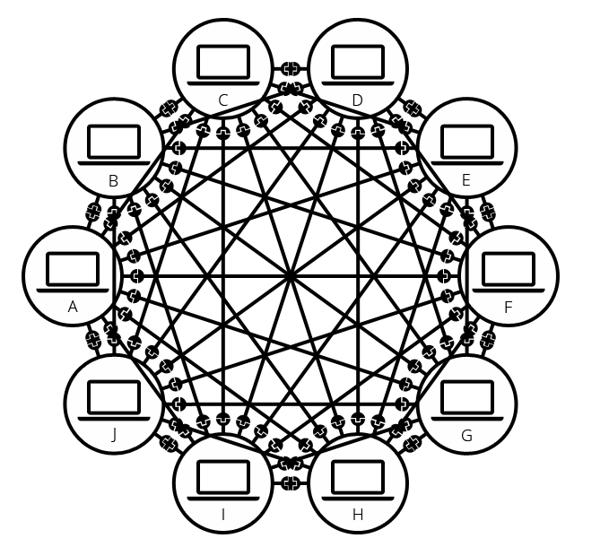
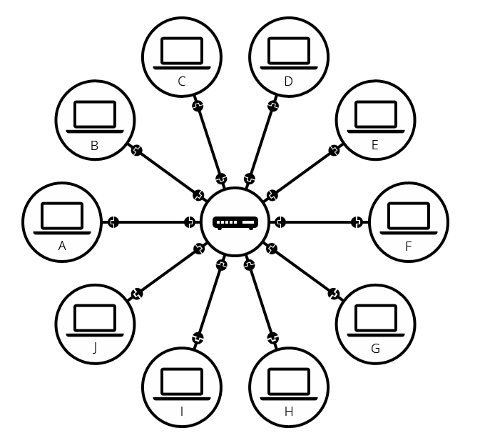
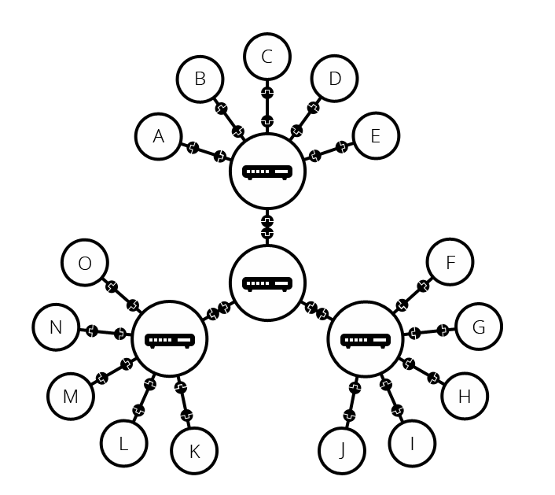
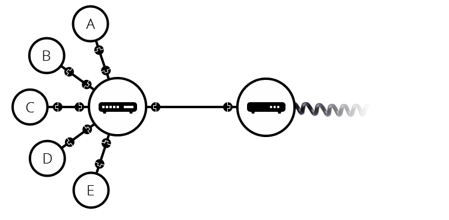

인터넷의 작동원리
==
인터넷이란?
--
인터넷은 정보를 담고있는 각 컴퓨터들을 TCP/IP 통신 프로토콜을 이용해 서로 정보를 주고받는 한 컴퓨터 네트워크를 의미함.

 
네트워크
--
두 개의 컴퓨터가 통신이 필요할 때, 우리는 다른 컴퓨터와 물리적으로 또는 무선으로 연결되어야 함. 
그러나 이러한 네트워크는 두 대의 컴퓨터만이 아닌 원하는 만큼 연결할 수 있는데, 많이 연결할수록 복잡성이 빠르게 증가함. 

 
라우터
--
위와 같은 문제를 해결하기 위해 사용하는 것이 *라우터* 이다. 이는 특수한 소형 컴퓨터로서, 단 하나의 작업만을 수행한다. 
컴퓨터 A가 V로 메시지를 보낼경우 A는 메시지를 라우터로 보내고, 라우터는 컴퓨터를 B에게 보내고 C에게는 보내지 않도록 한다.

 
네트워크 속의 네트워크
--
라우터를 사용해 여러개의 컴퓨터를 연결하는 문제는 해결할 수 있다.  
그런데 만약 연결해야되는 컴퓨터가 수백 수천일 경우 컴퓨터-라우터, 라우터-라우터 연결을 통해 무한히 확장할 수 있다.

  
이렇게 네트워크를 구성할 수 있지만, 이런식으로 하면 다른 네트워크와 연결할 수 없게된다.  이때 다른 시설과 연결하기 위해서는 *모뎀*이라는 특수 장비가 필요하다.

참조
--
https://developer.mozilla.org/ko/docs/Learn/Common_questions/How_does_the_Internet_work 

https://velog.io/@doomchit_3/Internet-internet-what-how-IMBETPY